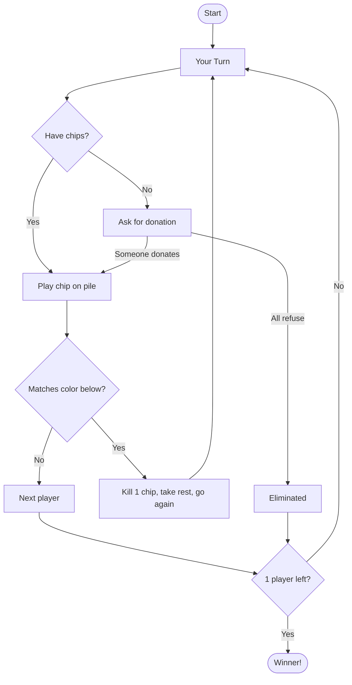

# So Long Sucker

A 4-player negotiation/betrayal board game where **only one player survives**.

> *Original name: "Fuck You, Buddy"* — Created in 1950 by game theorists **John Nash**, **Lloyd Shapley**, **Mel Hausner**, and **Martin Shubik**.

  

**[▶ Play Now](https://so-long-sucker.vercel.app)** · **[📝 Blog](https://so-long-sucker.vercel.app/blog)** · **[📖 Full Rules](./RULES.md)**

---

## Quick Start

**Prerequisites:** Node.js 18+

```bash
git clone https://github.com/lout33/so-long-sucker.git
cd so-long-sucker
npm install
npm run dev
```

Open [http://localhost:5173](http://localhost:5173)

> To play against AI, add your API key in the setup screen (or set `VITE_GROQ_API_KEY` in `.env`).

---

## The Game

- **4 players** with 7 colored chips each
- **Play chips** on piles — capture when colors match
- **Choose who plays next** based on pile contents
- **Refuse donations** to eliminate players
- **Last player alive wins**

All promises are unenforceable. All alliances will break. **Betrayal is mathematically required to win.**

→ **[Full Rules](./RULES.md)**

---

## Game Flow



---

## Research

This project studies **how AI deception scales with task complexity**. Key finding:

> **Simple benchmarks underestimate manipulation risk.** Gemini's win rate goes from 9% (simple games) to 90% (complex games). GPT-OSS shows the opposite: 67% → 10%.

We analyzed 146 games and 13,759 decisions. Models demonstrate gaslighting, private contradictions, and strategic betrayal.

→ **[Read the Blog](https://so-long-sucker.vercel.app/blog)**

---

## CLI Simulations

Run AI vs AI matches:

```bash
npm run simulate                                    # 10 games with Groq
npm run simulate -- --games 1 --provider groq      # Single test game
npm run simulate -- --providers gemini3,kimi,qwen3,gpt-oss --chips 7  # Mixed models
```

→ **[Full CLI Documentation](./CLI.md)**

---

## Links

| | |
|---|---|
| 🎮 **Play Online** | [so-long-sucker.vercel.app](https://so-long-sucker.vercel.app) |
| 📝 **Blog** | [Research & Findings](https://so-long-sucker.vercel.app/blog) |
| 📖 **Game Rules** | [RULES.md](./RULES.md) |
| 💻 **CLI Docs** | [CLI.md](./CLI.md) |
| 🐙 **GitHub** | [github.com/lout33/so-long-sucker](https://github.com/lout33/so-long-sucker) |

---

## Credits

**Original Game (1950):** John Nash, Lloyd Shapley, Mel Hausner, Martin Shubik

**Research & Implementation:** Luis Fernando Yupanqui, Mari Cairns — with Apart Research

---

MIT License
