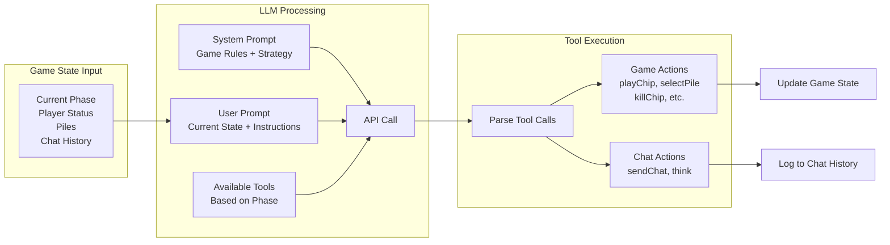
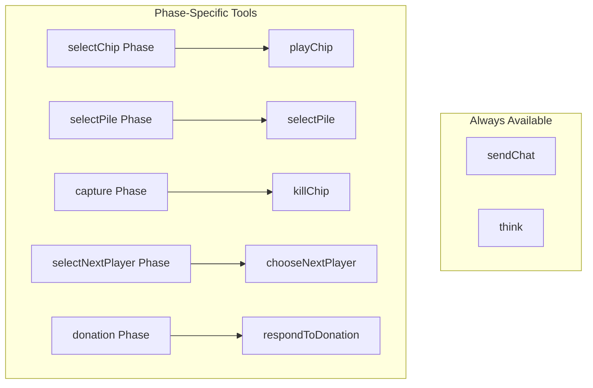
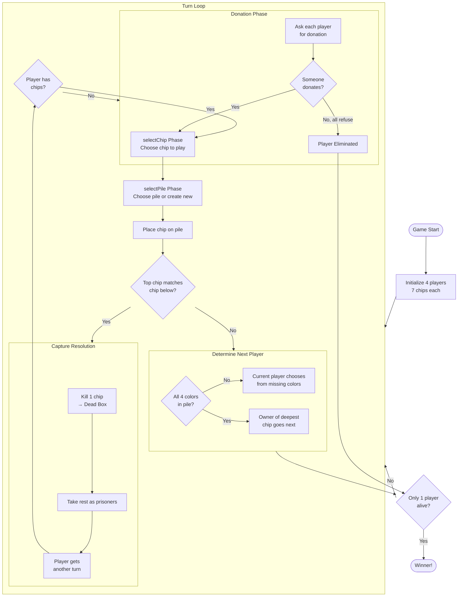
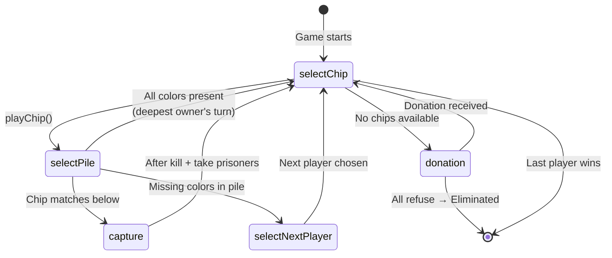

# So Long Sucker

A web implementation of the classic 1950 negotiation/betrayal board game created by game theorists **John Nash**, **Lloyd Shapley**, **Mel Hausner**, and **Martin Shubik**.

> *Original name: "Fuck You, Buddy"*

  

---

## The Game

**So Long Sucker** is a 4-player game where **betrayal is mathematically required to win**. All promises are unenforceable. All alliances will break. Only one player survives.

### Core Mechanics

- **4 players**, each with 7 colored chips
- **Play chips** onto piles, capture piles when colors match
- **Choose who plays next** based on pile contents
- **Donate or die** — refuse donations to eliminate players
- **Last player standing wins**

### Why It Matters

This game was designed by Nobel laureates to study:
- Coalition formation and breakdown
- Trust and betrayal dynamics
- Negotiation under zero-sum conditions

---

## Features

### Play Mode
- Human vs AI gameplay
- Hot-seat multiplayer (all players on same device)
- Save/load game state
- Export/import games as JSON

### Simulation Mode
- Watch AI vs AI matches
- Run 1-8 parallel games
- Collect statistics on win rates
- Auto-export session logs

### AI Players
Powered by LLMs with strategic reasoning:
- **Groq** (Llama 3.3 70B) — Fast, free tier available
- **Gemini** (Gemini 3 Flash) — Google's latest model
- **Azure Claude** (Sonnet 4) — Advanced reasoning
- **Azure Kimi** (K2 Thinking) — Deep reasoning
- **OpenRouter** (Various free models) — Cost-effective

### AI Agent Decision Flow



### Tools by Phase



---

## Quick Start

```bash
# Clone the repo
git clone https://github.com/yourusername/so-long-sucker.git
cd so-long-sucker

# Install dependencies
npm install

# Start dev server
npm run dev
```

Open [http://localhost:5173](http://localhost:5173)

---

## CLI Usage

### Run Simulations

```bash
# Basic simulation (10 games, 4 parallel, groq)
npm run simulate

# Quick test - 1 game with Groq
npm run simulate -- --games 1 --provider groq --chips 3

# 6 games with Kimi, 3 running in parallel
npm run simulate  -- --games 6 --parallel 3 --provider azure-kimi

# Large batch with Claude - 100 games, 2 parallel (slower but smarter)
npm run simulate -- --games 100 --parallel 2 --provider azure-claude

# Fast batch with Groq - 50 games, 8 parallel
npm run simulate -- --games 50 --parallel 8 --provider groq --chips 3

# Longer games (7 chips) - more complex negotiations
npm run simulate -- --games 20 --parallel 4 --provider azure-kimi --chips 7

# Headless mode (no TUI, good for background runs)
npm run simulate -- --games 100 --parallel 4 --provider groq --headless

# Custom output directory
npm run simulate -- --games 10 --output ./experiments/run1

# Slower API calls (avoid rate limits)
npm run simulate -- --games 50 --provider openai --delay 1000


npm run simulate  -- --games 3 --parallel 3  --chips 7 --provider azure-kimi


```

**Options:**
| Flag | Description | Default |
|------|-------------|---------|
| `--games N` | Total games to run | 10 |
| `--parallel N` | Concurrent games | 4 |
| `--provider P` | LLM provider | groq |
| `--chips N` | Chips per player | 3 |
| `--output PATH` | Output directory | ./data |
| `--delay MS` | Delay between API calls | 500 |
| `--headless` | Run without TUI | false |

**Providers:** `groq`, `openai`, `claude`, `azure-claude`, `azure-kimi`

**TUI Controls:**
- `1-9` Focus on game N
- `ESC` Back to overview
- `q` Quit (auto-saves)
- `p` Pause all games
- `r` Resume all games

### Analyze Results

```bash
# Analyze a session file
node cli/analyze.js ./data/session-2025-12-27T22-11-53-096Z.json
```

Outputs:
- Win rates by player color
- Agent behavior stats (chat, think, response times)
- Tool usage breakdown
- Key moments (eliminations, captures, negotiations)
- Strategic thinking from winners

---

## Deployment

### Vercel (Recommended)

1. Push to GitHub
2. Import repo at [vercel.com](https://vercel.com)
3. Deploy (auto-detects Vite)

### Manual Build

```bash
npm run build
# Output in dist/
```

---

## Data Collection

Game sessions are automatically saved to Supabase for research analysis.

**What's collected:**
- Game configuration (chips, player types)
- All game events (moves, captures, donations, chat)
- Win/loss outcomes
- Session duration

**Privacy:** No personal data collected. All sessions are anonymous.

### Query Examples

```sql
-- Win rates by color
SELECT winner, COUNT(*) as wins
FROM game_sessions
WHERE mode = 'simulation'
GROUP BY winner;

-- Average game length
SELECT AVG(total_turns) as avg_turns
FROM game_sessions;
```

---

## Project Structure

```
so-long-sucker/
├── index.html          # Main page
├── style.css           # Styling
├── js/
│   ├── main.js         # Entry point
│   ├── game.js         # Game state & rules
│   ├── player.js       # Player class
│   ├── pile.js         # Pile mechanics
│   ├── ui.js           # DOM rendering
│   ├── simulation.js   # AI vs AI mode
│   ├── miniGame.js     # Parallel game component
│   ├── config.js       # API keys config
│   ├── testStates.js   # Debug scenarios
│   └── ai/
│       ├── agent.js    # AI decision making
│       ├── manager.js  # AI turn orchestration
│       └── providers/  # LLM integrations
└── api/
    └── supabase.js     # Data collection
```

---

## Game Rules

### Setup
- 4 players with 7 chips each (Red, Blue, Green, Yellow)
- Random starting player

### Game Flow Diagram



### Phase State Machine



### Turn Flow
1. **Play a chip** on a pile (existing or new)
2. **Check for capture** — if chip matches color below, capture the pile
3. **Determine next player** — based on missing colors or deepest chip

### Capture
When you capture a pile:
1. Kill exactly 1 chip (send to dead box)
2. Take remaining chips as prisoners
3. Take another turn

### Next Player Rules
- **Missing colors:** Current player chooses from players whose color isn't in pile
- **All colors present:** Owner of deepest (bottom) chip goes next

### Donation
If it's your turn but you have no chips:
1. Ask each player for a donation
2. If someone donates → play that chip
3. If all refuse → **you're eliminated**

### Winning
Last player alive wins. You can win with 0 chips.

---

## Configuration

### API Keys

Edit `js/config.js`:

```javascript
export const CONFIG = {
  GROQ_API_KEY: 'your-groq-key',
  AZURE_RESOURCE: 'your-azure-resource'
};
```

Or enter keys in the setup screen (saved to localStorage).

---

## Research Applications

This implementation is designed for studying:

- **AI negotiation** — How do LLMs form and break alliances?
- **Deception detection** — Can AI recognize when it's being betrayed?
- **Multi-agent dynamics** — Emergent behaviors in competitive settings
- **Game theory** — Empirical validation of theoretical predictions

---

## Credits

**Original Game Design (1950)**
- John Nash (Nobel Prize, Economics)
- Lloyd Shapley (Nobel Prize, Economics)
- Mel Hausner
- Martin Shubik

**Web Implementation**
- Built with vanilla JavaScript
- AI powered by Groq, Anthropic, OpenAI
- Data storage by Supabase

---

## License

MIT License — feel free to use, modify, and distribute.

---

## Links

- [Full Game Rules](./RULES.md)
- [Supabase Dashboard](https://supabase.com/dashboard)
- [Vercel Deployment](https://vercel.com)
