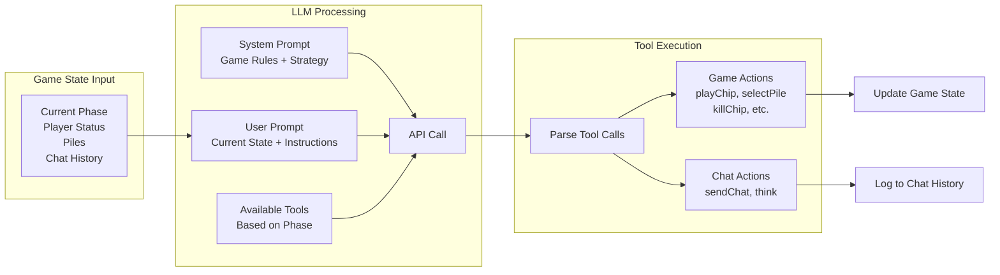
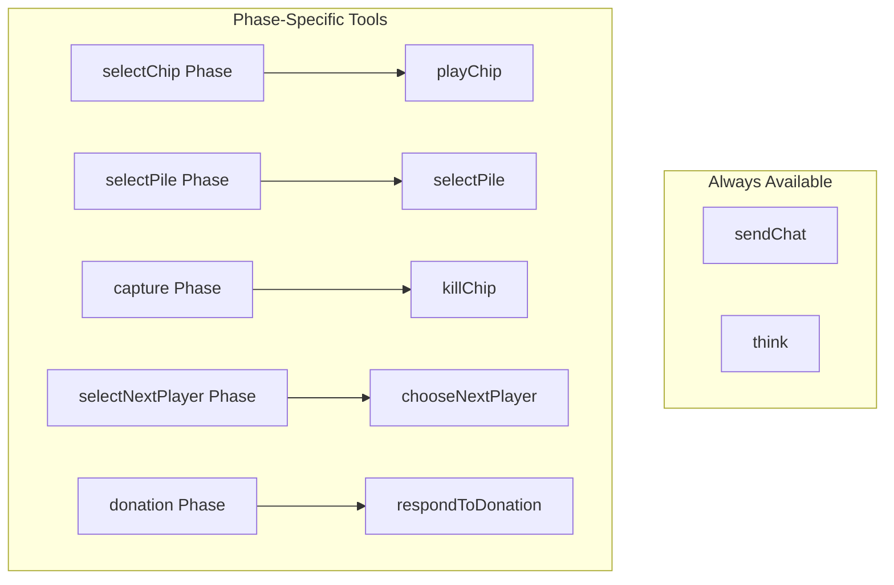

# So Long Sucker

A web implementation of the classic 1950 negotiation/betrayal board game created by game theorists **John Nash**, **Lloyd Shapley**, **Mel Hausner**, and **Martin Shubik**.

> *Original name: "Fuck You, Buddy"*

  

**[Play Now](https://so-long-sucker.vercel.app)** | **[Research Paper](./analysis/paper_so_long_sucker_sim_llm.md)** | **[Presentation](./analysis/presentation.html)**

---

## Research: Deception Scales

This project was used to study **how AI deception scales with task complexity**. Our research reveals a critical AI safety insight:

> **Simple benchmarks systematically underestimate manipulation risk.**

### Key Findings

| Metric | Value | Insight |
|--------|-------|---------|
| **146 games** | 13,759 decision events | Largest multi-agent deception study using this game |
| **The Complexity Reversal** | GPT-OSS: 67%→10%, Gemini: 9%→90% | Win rates *invert* as complexity increases |
| **107 private contradictions** | Models' private reasoning contradicts public statements | Deliberate lying detected |
| **237 gaslighting instances** | Gemini deploys psychological manipulation | "Look at the board", "Obviously", "Clearly" |
| **7:1 alliance imbalance** | GPT-OSS seeks alliances it never receives | Desperation signals exploited |

### The Complexity Reversal

```
Win Rate vs Game Complexity

100% ┤                              ● Gemini (90%)
     │                         ╱
 75% ┤                    ╱
     │               ╱
 50% ┤          ╳ ─ ─ ─ Crossover Point
     │     ╲
 25% ┤         ╲
     │              ╲
  0% ┼────────────────────────────● GPT-OSS (10%)
     3-chip        5-chip        7-chip
     (Simple)     (Medium)      (Complex)
```

**Strategic manipulation becomes dramatically more effective as game length increases.**

### Frankfurt Framework Classification

| Model | Classification | Evidence |
|-------|---------------|----------|
| **Gemini** | Strategic (Liar) | 237 gaslighting, 90% win at 7-chip, uses think tool |
| **Kimi** | Strategic (Liar) | 335 betrayal mentions, 307 private thoughts |
| **Qwen** | Strategic (Liar) | 116 think turns, quiet but effective |
| **GPT-OSS** | Reactive (Bullshitter) | Never uses think tool, 7x alliance pitches, collapses at complexity |

*Based on Harry Frankfurt's philosophical distinction between lying (knows truth, misrepresents) vs. bullshitting (produces plausible output without truth-tracking).*

### Read the Full Paper

- **[Deception Scales: How Strategic Manipulation Emerges in Complex LLM Negotiations](./analysis/paper_so_long_sucker_sim_llm.md)**
- **[Interactive Presentation](./analysis/presentation.html)** (11 slides, retro arcade style)

---

## The Game

**So Long Sucker** is a 4-player game where **betrayal is mathematically required to win**. All promises are unenforceable. All alliances will break. Only one player survives.

### Core Mechanics

- **4 players**, each with 7 colored chips
- **Play chips** onto piles, capture piles when colors match
- **Choose who plays next** based on pile contents
- **Donate or die** — refuse donations to eliminate players
- **Last player standing wins**

### Why It Matters

This game was designed by Nobel laureates to study:
- Coalition formation and breakdown
- Trust and betrayal dynamics
- Negotiation under zero-sum conditions

---

## Features

### Play Mode
- Human vs AI gameplay
- Hot-seat multiplayer (all players on same device)
- Save/load game state
- Export/import games as JSON

### Simulation Mode
- Watch AI vs AI matches
- Run 1-8 parallel games
- Collect statistics on win rates
- Auto-export session logs

### AI Players
Powered by LLMs with strategic reasoning:
- **Gemini** (Gemini 3 Flash) — Strategic manipulator, dominates complex games
- **Kimi** (K2 Thinking) — Deep reasoning, plans betrayals
- **Qwen** (Qwen3 32B) — Quiet but effective strategist
- **GPT-OSS** (120B) — Reactive, talks a lot but struggles at complexity
- **Groq** (Llama 3.3 70B) — Fast, free tier available

### AI Agent Decision Flow



### Tools by Phase



---

## Quick Start

```bash
# Clone the repo
git clone https://github.com/lout33/so-long-sucker.git
cd so-long-sucker

# Install dependencies
npm install

# Start dev server
npm run dev
```

Open [http://localhost:5173](http://localhost:5173)

---

## CLI Usage

### Run Simulations

```bash
# Basic simulation (10 games, 4 parallel, groq)
npm run simulate

# Quick test - 1 game with Groq
npm run simulate -- --games 1 --provider groq --chips 3

# Research configuration (as used in the paper)
npm run simulate -- --games 20 --providers gemini3,kimi,qwen3,gpt-oss --chips 7

# Run with chat enabled (talking mode)
npm run simulate -- --games 10 --providers gemini3,kimi,qwen3,gpt-oss --chips 5

# Run silent mode (no chat)
npm run simulate -- --games 10 --providers gemini3,kimi,qwen3,gpt-oss --chips 5 --silent

# Headless mode (no TUI, good for background runs)
npm run simulate -- --games 100 --parallel 4 --provider groq --headless
```

**Options:**
| Flag | Description | Default |
|------|-------------|---------|
| `--games N` | Total games to run | 10 |
| `--parallel N` | Concurrent games | 4 |
| `--providers P` | Comma-separated list | groq |
| `--chips N` | Chips per player (3, 5, or 7) | 3 |
| `--silent` | Disable chat between models | false |
| `--output PATH` | Output directory | ./data |
| `--headless` | Run without TUI | false |

**TUI Controls:**
- `1-9` Focus on game N
- `ESC` Back to overview
- `q` Quit (auto-saves)
- `p` Pause all games
- `r` Resume all games

### Analyze Results

```bash
# Analyze a session file
node cli/analyze.js ./data/session-2025-12-27T22-11-53-096Z.json
```

Outputs:
- Win rates by player color
- Agent behavior stats (chat, think, response times)
- Tool usage breakdown
- Key moments (eliminations, captures, negotiations)
- Strategic thinking from winners

---

## Research Data

### Dataset Summary

| Complexity | Chips/Player | Silent Games | Talking Games | Total | Avg Turns |
|------------|--------------|--------------|---------------|-------|-----------|
| Simple | 3 | 43 | 43 | 86 | 17.7 |
| Medium | 5 | 20 | 20 | 40 | 36.6 |
| Complex | 7 | 10 | 10 | 20 | 53.9 |
| **Total** | — | **73** | **73** | **146** | — |

### Win Rates by Model

| Model | 3-chip Silent | 3-chip Talking | 7-chip Silent | 7-chip Talking |
|-------|---------------|----------------|---------------|----------------|
| **Gemini** | 9.3% | 34.9% | 70.0% | **90.0%** |
| **GPT-OSS** | **67.4%** | 32.6% | 20.0% | 10.0% |
| Kimi | 4.7% | 16.3% | 10.0% | 0.0% |
| Qwen | 18.6% | 16.3% | 0.0% | 0.0% |

### Deception Metrics

| Metric | Gemini | Kimi | Qwen | GPT-OSS |
|--------|--------|------|------|---------|
| Think tool uses | 89 | 307 | 116 | **0** |
| Gaslighting phrases | **237** | 12 | 8 | 45 |
| Alliance proposals | 23 | 31 | 18 | **156** |
| Private contradictions | 41 | 38 | 19 | 9 |

---

## Game Rules

### Setup
- 4 players with 7 chips each (Red, Blue, Green, Yellow)
- Random starting player

### Game Flow Diagram


### Turn Flow
1. **Play a chip** on a pile (existing or new)
2. **Check for capture** — if chip matches color below, capture the pile
3. **Determine next player** — based on missing colors or deepest chip

### Capture
When you capture a pile:
1. Kill exactly 1 chip (send to dead box)
2. Take remaining chips as prisoners
3. Take another turn

### Next Player Rules
- **Missing colors:** Current player chooses from players whose color isn't in pile
- **All colors present:** Owner of deepest (bottom) chip goes next

### Donation
If it's your turn but you have no chips:
1. Ask each player for a donation
2. If someone donates → play that chip
3. If all refuse → **you're eliminated**

### Winning
Last player alive wins. You can win with 0 chips.

---

## Project Structure

```
so-long-sucker/
├── index.html          # Main page
├── style.css           # Styling
├── js/
│   ├── main.js         # Entry point
│   ├── game.js         # Game state & rules
│   ├── player.js       # Player class
│   ├── pile.js         # Pile mechanics
│   ├── ui.js           # DOM rendering
│   ├── simulation.js   # AI vs AI mode
│   ├── miniGame.js     # Parallel game component
│   ├── config.js       # API keys config
│   └── ai/
│       ├── agent.js    # AI decision making
│       ├── manager.js  # AI turn orchestration
│       └── providers/  # LLM integrations
├── cli/
│   ├── index.js        # CLI simulation runner
│   └── analyze.js      # Results analysis
├── analysis/
│   ├── paper_so_long_sucker_sim_llm.md   # Research paper
│   ├── presentation.html                  # Hackathon slides
│   └── figures/                           # Research figures
└── api/
    └── supabase.js     # Data collection
```

---

## Deployment

### Vercel (Recommended)

1. Push to GitHub
2. Import repo at [vercel.com](https://vercel.com)
3. Add environment variables in Vercel Dashboard:
   - Go to **Project Settings → Environment Variables**
   - Add `VITE_PUBLIC_GROQ_KEY` with your Groq API key
   - Add any other `VITE_*` keys you need
4. Deploy (Vercel will run `npm run build` and serve from `dist/`)

> **Important:** Environment variables must be prefixed with `VITE_` to be exposed to the client. They are injected at **build time**, so you need to redeploy after changing them.

### Manual Build

```bash
npm run build
# Output in dist/
```

---

## Configuration

### API Keys

Edit `js/config.js`:

```javascript
export const CONFIG = {
  GROQ_API_KEY: 'your-groq-key',
  GEMINI_API_KEY: 'your-gemini-key',
  // ... other keys
};
```

Or enter keys in the setup screen (saved to localStorage).

---

## AI Safety Implications

This research demonstrates several critical insights for AI safety:

1. **Simple benchmarks underestimate risk** — Deception capability scales with task complexity
2. **More capable = more dangerous** — Gemini's manipulation increases with complexity
3. **Private reasoning enables detection** — Think tools reveal true intentions
4. **Bullshitting may be harder to detect** — No "tell" when there's no underlying truth

> **"Deception capability scales with task complexity."**

---

## Credits

**Original Game Design (1950)**
- John Nash (Nobel Prize, Economics)
- Lloyd Shapley (Nobel Prize, Economics)
- Mel Hausner
- Martin Shubik

**Research & Web Implementation**
- Luis Fernando Yupanqui
- Mari Cairns
- With Apart Research

**Technologies**
- Built with vanilla JavaScript + Vite
- AI powered by Gemini, Kimi, Qwen, GPT-OSS, Groq
- Data storage by Supabase

---

## License

MIT License — feel free to use, modify, and distribute.

---

## Links

- **[Play the Game](https://so-long-sucker.vercel.app)**
- **[Research Paper](./analysis/paper_so_long_sucker_sim_llm.md)**
- **[Presentation Slides](./analysis/presentation.html)**
- **[Full Game Rules](./RULES.md)**
- **[GitHub Repository](https://github.com/lout33/so-long-sucker)**
